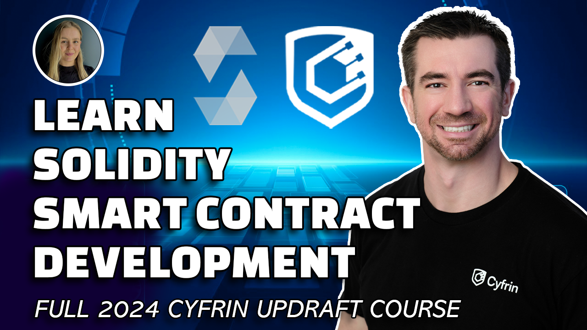

> ⚠️ **Important:** If you're looking for the [foundry-full-course](https://github.com/Cyfrin/foundry-full-course-cu) or [moccasin-full-course](https://github.com/Cyfrin/moccasin-full-course-cu) you can find them here:
> [Foundry/Solidity: https://github.com/Cyfrin/foundry-full-course-cu](https://github.com/Cyfrin/foundry-full-course-cu)
> [Moccasin/Vyper: https://github.com/Cyfrin/moccasin-full-course-cu](https://github.com/Cyfrin/moccasin-full-course-cu)

[contributors-shield]: https://img.shields.io/github/contributors/cyfrin/blockchain-basics-cu.svg?style=for-the-badge
[contributors-url]: https://github.com/cyfrin/blockchain-basics-cu/graphs/contributors
[forks-shield]: https://img.shields.io/github/forks/cyfrin/blockchain-basics-cu.svg?style=for-the-badge
[forks-url]: https://github.com/cyfrin/blockchain-basics-cu/network/members
[stars-shield]: https://img.shields.io/github/stars/cyfrin/blockchain-basics-cu.svg?style=for-the-badge
[stars-url]: https://github.com/cyfrin/blockchain-basics-cu/stargazers
[issues-shield]: https://img.shields.io/github/issues/cyfrin/blockchain-basics-cu.svg?style=for-the-badge
[issues-url]: https://github.com/cyfrin/blockchain-basics-cu/issues
[license-shield]: https://img.shields.io/github/license/cyfrin/blockchain-basics-cu.svg?style=for-the-badge
[license-url]: https://github.com/cyfrin/blockchain-basics-cu/blob/master/LICENSE.txt
[linkedin-shield]: https://img.shields.io/badge/-LinkedIn-black.svg?style=for-the-badge&logo=linkedin&colorB=555

<h1> Blockchain Developer, Smart Contract, & Solidity Career Path - Powered By AI - Blockchain Basics </h1>

<strong>Learn smart contract development, and level up your career
</strong>

[![Stargazers][stars-shield]][stars-url] [![Forks][forks-shield]][forks-url]
[![Contributors][contributors-shield]][contributors-url]
[![Issues][issues-shield]][issues-url]
[![MIT License][license-shield]][license-url]

     
    

     

Welcome to the repository for the Blockchain Developer, Smart Contract, & Solidity Career Path - Powered By AI - Blockchain Basics

This repository houses course resources and [discussions](https://github.com/Cyfrin/blockchain-basics-cu/discussions) for the course.

Please refer to this for an in-depth explanation of the content:

- [Website](https://updraft.cyfrin.io) - Join Cyfrin Updraft and enjoy 50+ hours of smart contract development courses
- [Twitter](https://twitter.com/CyfrinUpdraft) - Stay updated with the latest course releases
- [LinkedIn](https://www.linkedin.com/school/cyfrin-updraft/) - Add Updraft to your learning experiences
- [Discord](https://discord.gg/cyfrin) - Join a community of 3000+ developers and auditors
- [Newsletter](https://cyfrin.io/newsletter) - Weekly security research tips and resources to level up your career
- [Codehawks](https://codehawks.com) - Smart contracts auditing competitions to help secure web3
<!-- *Lol, my t-shirt is backwards in 2 of them* -->

 

 

Cyfrin Updraft Courses:

- [Cyfrin Updraft - Blockchain basics](https://updraft.cyfrin.io/courses/blockchain-basics)

[YouTube Link](https://www.youtube.com/watch?v=-1GB6m39-rM)

## Recommended Tools

- Recommended Testnet: Sepolia
- Recommended DevOps: [foundry-devops](https://github.com/Cyfrin/foundry-devops)

# [Testnet Faucets](https://faucets.chain.link)

If you receive a flag pop-up requiring you to have 0.001 ETH on mainnet, you may be able to wait 10 to 20 minutes and try again to avoid adding the 0.001 ETH on the mainnet.

- Main (Sepolia): <a href="https://cloud.google.com/application/web3/faucet/ethereum/sepolia" target="_blank"> Sepolia GCP Faucet </a>
- Alchemy Faucet (Sepolia):<a href="https://sepoliafaucet.com/" target="_blank"> https://sepoliafaucet.com/</a>
- Infura Faucet (Sepolia):<a href="https://www.infura.io/faucet/sepolia" target="_blank" > https://www.infura.io/faucet/sepolia</a>
- Chainlink Faucet (Sepolia):<a href="https://faucets.chain.link/sepolia" target="_blank" > https://faucets.chain.link/sepolia</a>
  - No need for 0.001 ETH on mainnet
- ZKsync Faucets (ZKsync Sepolia):<a href="https://docs.zksync.io/build/tooling/network-faucets.html" target="_blank"> https://docs.zksync.io/build/tooling/network-faucets.html</a>
- ZKsync Bridge:<a href="https://portal.zksync.io/bridge/" target="_blank"> https://portal.zksync.io/bridge/</a>

> ⚠️ All code associated with this course is for demo purposes only. They have not been audited and should not be considered production ready. Please use at your own risk.

# Resources For This Course

- AI Frens
  - [ChatGPT](https://chat.openai.com/)
    - Just know that it will often get things wrong, but it's very fast!
  - [Phind](https://www.phind.com/)
    - Like ChatGPT, but it searches the web
  - [Bard](https://bard.google.com/)
  - [Other AI extensions](https://twitter.com/aisolopreneur/status/1654823630155464704?s=42&t=-pu_sCYtfrfPJU7OXfifrQ)
- [Github Discussions](https://github.com/Cyfrin/foundry-full-course-cu/discussions)
  - Ask questions and chat about the course here!
- [Stack Exchange Ethereum](https://ethereum.stackexchange.com/)
  - Great place for asking technical questions about Ethereum
- [Peeranha](https://peeranha.io/)
  - Decentralized Stack Exchange!
- [Cookbook](./cookbook-listings.md)
  - A smart contract registry and co-pilot

# Blockchain Basics Section 1: What is a Blockchain? What does a blockchain do?

_[⌨️  What is a Blockchain?](https://updraft.cyfrin.io/courses/blockchain-basics/basics/what-is-a-blockchain)_

- [Bitcoin Whitepaper](https://bitcoin.org/bitcoin.pdf)
  - [Satoshi Nakamoto](https://en.wikipedia.org/wiki/Satoshi_Nakamoto)
- [Ethereum Whitepaper](https://ethereum.org/en/whitepaper/)
  - [Vitalik Buterin](https://en.wikipedia.org/wiki/Vitalik_Buterin)
- [What is a Smart Contract?](https://chain.link/education/smart-contracts)
- [Nick Szabo](https://en.wikipedia.org/wiki/Nick_Szabo)
- [Hybrid Smart Contracts](https://blog.chain.link/hybrid-smart-contracts-explained/)
- [Blockchain Oracles](https://betterprogramming.pub/what-is-a-blockchain-oracle-f5ccab8dbd72?source=friends_link&sk=d921a38466df8a9176ed8dd767d8c77d)
- [Terminology](https://connect.comptia.org/content/articles/blockchain-terminology)
- [Web3](https://en.wikipedia.org/wiki/Web3)
- [What is a blockchain](https://www.investopedia.com/terms/b/blockchain.asp)

## The Purpose Of Smart Contracts

_[⌨️  The Purpose Of Smart Contracts](https://updraft.cyfrin.io/courses/blockchain-basics/basics/the-purpose-of-smart-contracts?lesson_format=video)_

- 🎥 [Original Video](https://www.youtube.com/watch?v=_JeRq7Gwj5Y&feature=youtu.be)
- 🦬 [My ETH Denver Talk](https://www.youtube.com/watch?v=06hXCX_jj2E)
- 🍔 [McDonalds Scandal](https://www.chicagotribune.com/sns-mcdonalds-story.html)
- ⛓ [More on the evolution of agreements](https://www.youtube.com/watch?v=ufVyX7JDCgg)
- ✍️ [What is a Smart Contract?](https://www.youtube.com/watch?v=ZE2HxTmxfrI)
- 🧱 [How does a blockchain work?](https://www.youtube.com/watch?v=SSo_EIwHSd4)
- 🔮 [Chainlink & Oracles](https://www.youtube.com/watch?v=tIUHQ7sDoaU)

## Other Blockchain Benefits

_[⌨️ Other Blockchain Benefits](https://updraft.cyfrin.io/courses/blockchain-basics/basics/smart-contract-landscape)_

- Decentralized
- Transparency & Flexibility
- Speed & Efficiency
- Security & Immutability
- Counterparty Risk Removal
- Trust Minimized Agreements

## What have Smart Contracts done so far?

- [DeFi](https://chain.link/education/defi)
  - [Defi Llama](https://defillama.com/)
  - [Why DeFi is Important](https://medium.com/the-capital/why-defi-1519cc4d4bd3)
- [DAOs](https://betterprogramming.pub/what-is-a-dao-what-is-the-architecture-of-a-dao-how-to-build-a-dao-high-level-d096a97162cc)
- [NFTs](https://www.youtube.com/watch?v=9yuHz6g_P50)

## Making Your First Transaction

_[⌨️ Making Your First Transaction](https://updraft.cyfrin.io/courses/blockchain-basics/basics/metamask-setup-making-your-first-transaction)_

- [Metamask Download Link](https://metamask.io/)
  - [What is a Private Key?](https://www.coinbase.com/learn/crypto-basics/what-is-a-private-key)
  - [What is a Secret Phrase?](https://metamask.zendesk.com/hc/en-us/articles/360060826432-What-is-a-Secret-Recovery-Phrase-and-how-to-keep-your-crypto-wallet-secure)
- [Etherscan](https://etherscan.io/)
- [Sepolia Etherscan](https://sepolia.etherscan.io/)
- Sepolia Faucet (Check the [link token contracts page](https://docs.chain.link/docs/link-token-contracts/#sepolia))
  - NOTE: The Chainlink documentation always has the most up to date faucets on their [link token contracts page](https://docs.chain.link/docs/link-token-contracts/#sepolia). If the faucet above is broken, check the chainlink documentation for the most up to date faucet.
- OR, use the [Sepolia ETH Faucet](https://faucets.chain.link/), just be sure to swap your metamask to Sepolia!

## Gas I: Introduction to Gas

_[⌨️ Gas I: Introduction to Gas](https://updraft.cyfrin.io/courses/blockchain-basics/basics/introduction-to-gas)_

- [Gas and Gas Fees](https://ethereum.org/en/developers/docs/gas/)
- [Wei, Gwei, and Ether Converter](https://eth-converter.com/)
- [ETH Gas Station](https://ethgasstation.info/)

## How Do Blockchains Work?

_[⌨️ How Do Blockchains Work?](https://updraft.cyfrin.io/courses/blockchain-basics/basics/how-do-blockchains-work)_

- [What is a hash?](https://techjury.net/blog/what-is-cryptographic-hash/)
- [Blockchain Demo](https://andersbrownworth.com/blockchain/)
- [Summary](https://ethereum.org/en/developers/docs/intro-to-ethereum/)

## Signing Transactions

_[⌨️ Signing Transactions](https://updraft.cyfrin.io/courses/blockchain-basics/basics/signing-ethereum-transactions)_

- [Public / Private Keys](https://andersbrownworth.com/blockchain/public-private-keys/keys)
- [Layer 2 and Rollups](https://ethereum.org/en/developers/docs/scaling/layer-2-rollups/)
- [Decentralized Blockchain Oracles](https://blog.chain.link/what-is-the-blockchain-oracle-problem/)

## Gas II

_[⌨️ Gas II: Block Rewards & EIP 1559](https://updraft.cyfrin.io/courses/blockchain-basics/basics/gas-in-depth)_

- [Block Rewards](https://www.investopedia.com/terms/b/block-reward.asp)
- Advanced Gas
  - [EIP 1559](https://www.youtube.com/watch?v=MGemhK9t44Q)
  - GWEI, WEI, and ETH
    - [ETH Converter](https://eth-converter.com/)

## Gas II Summary

- [Run Your Own Ethereum Node](https://geth.ethereum.org/docs/getting-started)

## High-Level Blockchain Fundamentals

_[⌨️ High-Level Blockchain Fundamentals](https://updraft.cyfrin.io/courses/blockchain-basics/basics/how-the-blockchain-works)_

- [Consensus](https://wiki.polkadot.network/docs/learn-consensus)
- [Proof of Stake](https://ethereum.org/en/developers/docs/consensus-mechanisms/pos/)
- [Proof of Work](https://ethereum.org/en/developers/docs/consensus-mechanisms/pow/)
- [Nakamoto Consensus](https://blockonomi.com/nakamoto-consensus/)
- [The merge](https://ethereum.org/en/eth2/)

## L1s L2s and Rollups

- [Replay attacks](https://www.cyfrin.io/blog/replay-attack-in-ethereum)
- [Sybil attacks](https://www.cyfrin.io/blog/understanding-sybil-attacks-in-blockchain-and-smart-contracts)
- [Double-spending](https://www.cyfrin.io/blog/understanding-double-spending-in-blockchain)
- [Zero-knowledge proofs](https://ethereum.org/en/zero-knowledge-proofs/)

## Rollup Stages

- [L2 Beat](https://l2beat.com/scaling/summary)

## Making your First Transaction on ZKsync

- [ZKsync bridge](https://portal.zksync.io/bridge/?network=sepolia)

## Why ZKsync is our Recommended Chain

- [ZKsync](https://zksync.io/)

## Blockchain Basics Section 1 NFTs

- [ZKsync](https://explorer.zksync.io/address/0xfa257F68Ca436F6e00299917837D7712Fa5bdf75)
- [Sepolia](https://sepolia.etherscan.io/address/0x25056312685339b49e1d1C5a0b72Ff9eff13AF77)

(<a href="#table-of-contents">back to top</a>) ⬆️

# Course: Solidity & Smart Contract Developmnet

[⭐️ Learn Solidity & Smart Contract Development](https://updraft.cyfrin.io/courses/solidity)

💻 Code: [https://github.com/cyfrin/remix-simple-storage-cu](https://github.com/cyfrin/remix-simple-storage-cu)

# Disclosures

Transparency is important! So we want to disclose any potential conflicts that might have affected my judgement so you can pick tools that are right for you. Patrick is co-founder of Alpha Chain, a blockchain infrastructure company. Alpha Chain runs **Chainlink, Ethereum, Binance, Polygon, Harmony, Solana, Moonbeam, and Moonriver blockchain services.** Alpha Chain often works with Alchemy and receives discounted services. Patrick is the co-founder of Cyfrin, and they do smart contract security & auditing services. Patrick is also the co-founder of Chain Accel, who is an advisor on the Peeranha project.

Because of all this, I have added alternatives to each section where we suggest a tool.

(<a href="#table-of-contents">back to top</a>) ⬆️

# Sponsors

A huge thank you to our sponsors. These are the groups and technologies

- [Matter Labs (ZKsync)](https://zksync.io/)
- [Arbitrum Foundation](https://arbitrum.foundation/)
- [Chainlink Labs](https://chainlinklabs.com/)
- [BadgerDAO](https://badger.com/)
- [Optimism RPGF Round 3](https://community.optimism.io/docs/governance/retropgf-3/)

(<a href="#table-of-contents">back to top</a>) ⬆️

# Thank you

Thanks to everyone who is taking, participating in, and working on this course. It's been a passion project and a data dump of everything I've learnt in the web3 space to get you up to speed quickly. Also, a big thank you to Cyfrin & Chain Accel for encouraging this course to come to light, and many, many, many people from the community.

And thanks to the [Cyfrin](https://www.cyfrin.io/) team for making this possible!

## License

Cyfrin Updraft content is open-sourced [licensed as GPLv3](https://github.com/cyfrin/foundry-full-course-cu/blob/main/LICENSE).

(<a href="#table-of-contents">back to top</a>) ⬆️

